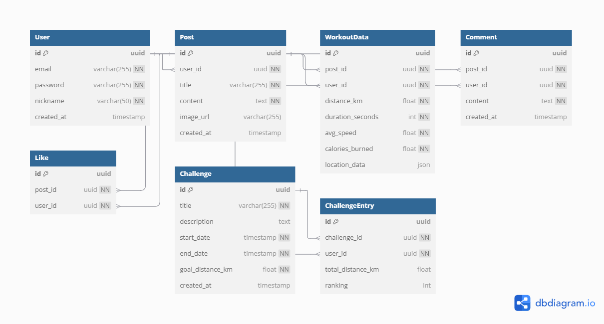

# 🏃 운동 인증 & 챌린지 REST API

## 📌 프로젝트 개요
운동 기록을 공유하고 챌린지를 통해 사용자 간 경쟁할 수 있는 REST API입니다.

## 🎯 주요 기능
- 📝 운동 인증 게시판 (사진 + 운동 데이터 등록)
- 🏆 챌린지 시스템 (목표 거리 설정 & 랭킹)
- 📊 운동 데이터 분석 (속도, 칼로리, 거리)

## 🗄 ERD 다이어그램

## 🛠 기술 스택
- **Backend**: Java 17, Spring Boot, JPA, Spring Security
- **DB**: PostgreSQL, Redis (캐싱)
- **DevOps**: Docker, AWS EC2/RDS
- **문서화**: Swagger

## 🚀 개발 진행 현황
- [x] ERD 설계
- [ ] API 개발 진행 중
